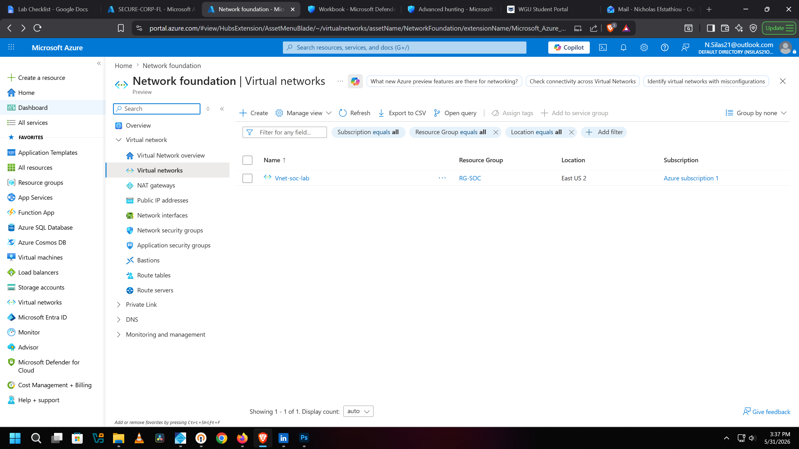
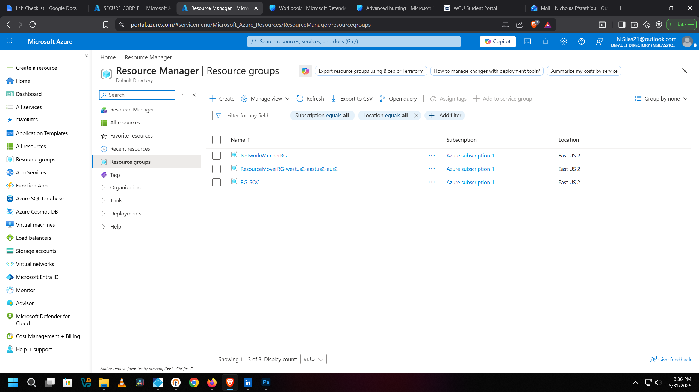
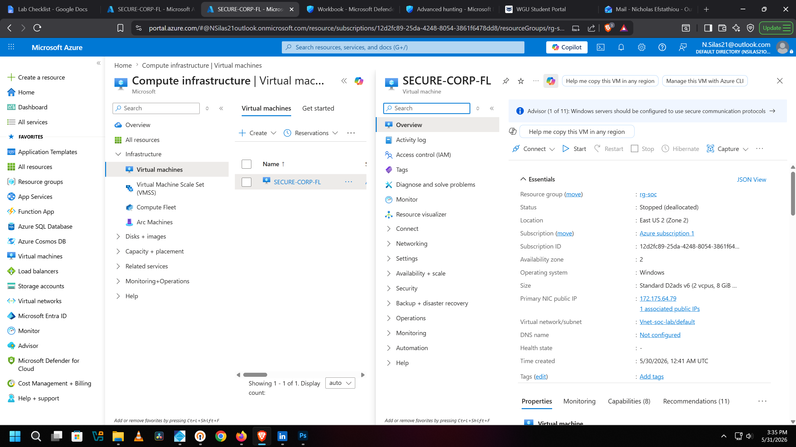
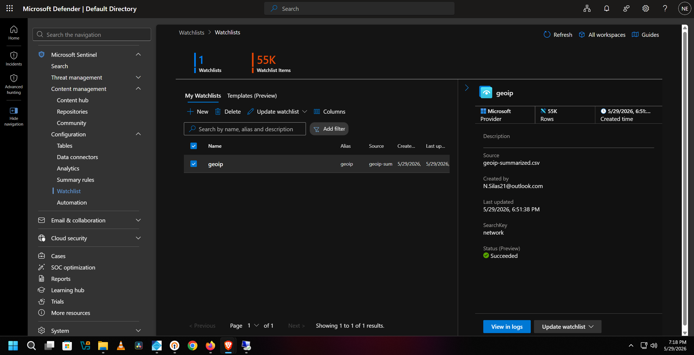
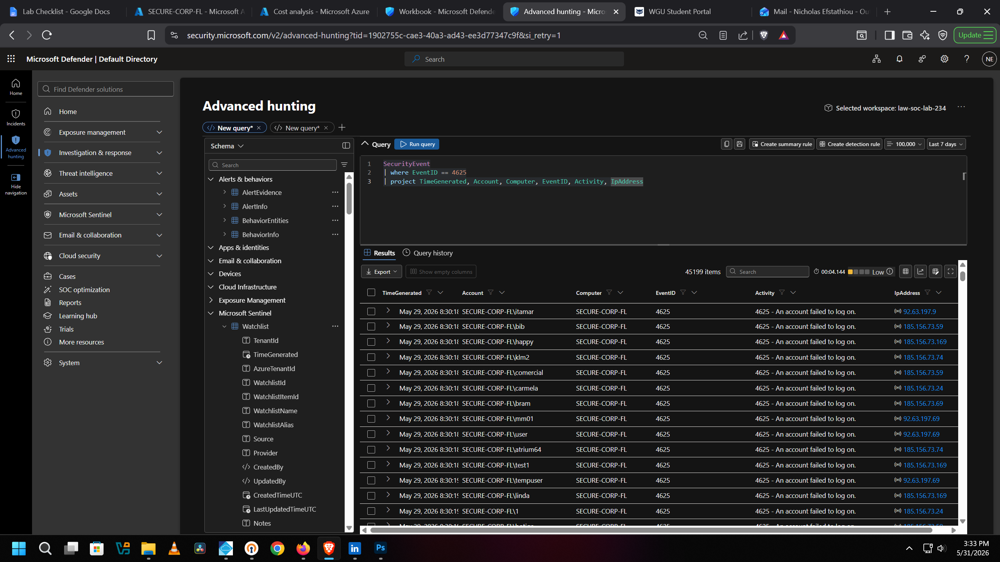
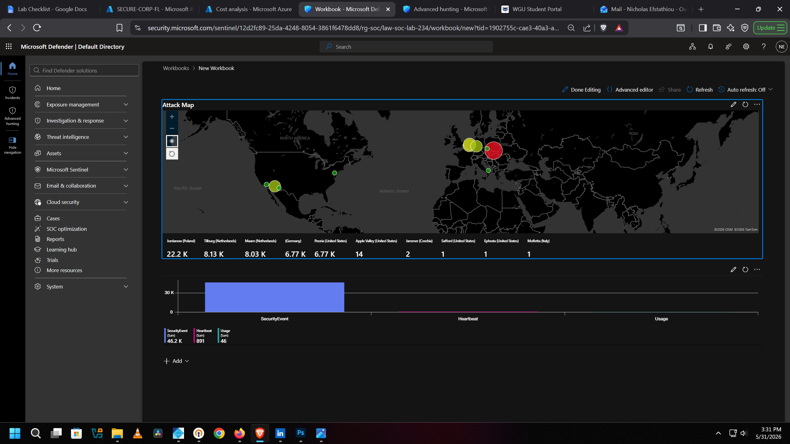

# 🛡️ SOC Analyst Home Lab: Azure Honeypot & SIEM Monitoring

Deployed an intentionally exposed Azure VM honeypot to attract and capture real-world attack traffic. Configured log forwarding to Azure Log Analytics and integrated Microsoft Sentinel as a SIEM to generate alerts and monitor live activity. Analyzed incoming event data including attacker IPs, failed RDP/login attempts, and Windows Security event logs to identify attack patterns and geographic origins. Built a Sentinel workbook with a live attack map visualizing global sources of brute-force attempts in real time.

---

## 🧰 Technologies & Tools

| Category | Technology |
|---|---|
| Cloud Platform | Microsoft Azure |
| SIEM | Microsoft Sentinel |
| Log Management | Azure Log Analytics Workspace |
| Threat Detection | KQL (Kusto Query Language) |
| GeoIP Enrichment | Sentinel Watchlist (geoip-summarized.csv, 55K rows) |
| Honeypot OS | Windows Server (Standard D2ads v6, 2 vCPUs, 8GB RAM) |
| Resource Location | East US 2, Zone 2 |

---

## 🌐 Virtual Network Configuration



Azure Virtual Network (Vnet-soc-lab) configured under the RG-SOC resource group in East US 2. This VNet provided the network foundation for the honeypot VM, handling routing, subnetting, and connectivity within the Azure environment. The VM's NIC was attached to the default subnet inside this VNet with a public IP intentionally exposed to capture inbound attack traffic from the internet.

---

## 📁 Resource Groups



Three resource groups provisioned under Azure subscription 1 in East US 2. The primary working group is **RG-SOC**, which contains all lab resources including the honeypot VM, Log Analytics Workspace, virtual network, and Microsoft Sentinel instance. NetworkWatcherRG was auto-created by Azure for network monitoring, and ResourceMoverRG-westus2-eastus2-eus2 was generated during region migration tasks.

---

## 🖥️ Azure Honeypot VM: SECURE-CORP-FL



Azure Virtual Machine (SECURE-CORP-FL) deployed as the honeypot for this project. Configured with a public-facing IP (172.175.64.79) and intentionally open network settings to attract real internet traffic. Connected to the Vnet-soc-lab virtual network and integrated with a Log Analytics Workspace to forward Windows Security event logs directly into Microsoft Sentinel for monitoring and analysis.

**VM Specs:**
- OS: Windows Server
- Size: Standard D2ads v6 (2 vCPUs, 8GB RAM)
- Location: East US 2, Availability Zone 2
- Resource Group: RG-SOC
- Public IP: 172.175.64.79

---

## 🔍 GeoIP Watchlist Configuration



GeoIP watchlist imported into Microsoft Sentinel containing **55,000 rows** of IP-to-location mapping data sourced from a summarized GeoIP CSV. This watchlist was used to enrich raw log data with geographic context, enabling the attack map to plot attacker origins by country and city. The watchlist was created on 5/29/2026 and is keyed on the network field for fast KQL lookups.

---

## 📊 Log Analysis with KQL



KQL query executed in Microsoft Sentinel's Advanced Hunting interface targeting **Windows Security Event ID 4625** (failed logon attempts). The query surfaces attacker account names, timestamps, source computer, event activity, and originating IP addresses. Results returned **45,199 items** within the last 7 days, showing a high volume of automated credential-stuffing and brute-force attempts hitting the honeypot from multiple external IPs including repeated attempts from the 185.156.73.x and 92.63.197.x ranges.

```kql
SecurityEvent
| where EventID == 4625
| project TimeGenerated, Account, Computer, EventID, Activity, IpAddress
```

---

## 🗺️ Microsoft Sentinel Live Attack Map



Microsoft Sentinel workbook displaying a real-time global attack map of brute-force attempts against the honeypot VM. Each dot represents a geographic source of attack traffic, with the largest volume originating from Jordanow, Poland (22.2K events), followed by Tilburg and Maarn in the Netherlands (8.13K and 8.03K), and multiple US cities. Total SecurityEvents logged: **46.2K**, with 891 Heartbeat events and 46 Usage events recorded across the monitoring period. Built using KQL queries feeding into a custom Sentinel workbook visualization.

---

## 🙋 Author

**Nick Efstathiou**
Cybersecurity | SOC Analysis | Cloud Security
[LinkedIn](https://www.linkedin.com/in/NickStat23)
